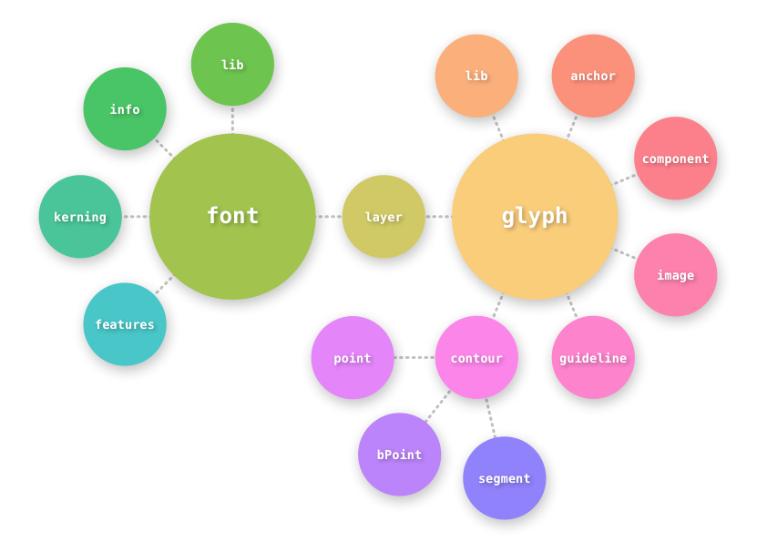

.. highlight:: python

################
Object Reference
################

FontParts scripts are built on with objects that represent fonts, glyphs, contours and so on. The objects are obtained through :ref:`fontparts-world`.

.. _fontparts-objects:

*******
Objects
*******

.. toctree::
   :maxdepth: 1

   font
   info
   groups
   kerning
   features
   lib
   layer
   glyph
   contour
   segment
   bpoint
   point
   component
   anchor
   image
   guideline

***********
Value Types
***********

FontParts uses some common value types.

.. toctree::
   :maxdepth: 2

   valuetypes

.. _fontparts-world:

***************
fontParts.world
***************

.. module:: fontParts.world

.. note::
   We still need to decide if we need a ``world`` module or if we should recommend namespace injection.

.. autofunction:: AllFonts
.. autofunction:: NewFont
.. autofunction:: OpenFont
.. autofunction:: CurrentFont
.. autofunction:: CurrentLayer
.. autofunction:: CurrentGlyph
.. autofunction:: CurrentContours
.. autofunction:: CurrentSegments
.. autofunction:: CurrentPoints
.. autofunction:: CurrentComponents
.. autofunction:: CurrentAnchors
.. autofunction:: CurrentGuidelines
